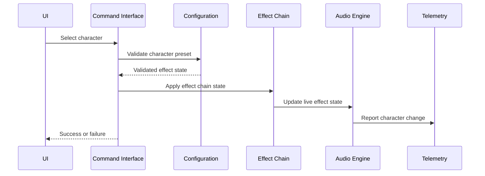

```mermaid
sequenceDiagram
    participant UI as UI
    participant Commands as Command Interface
    participant Config as Configuration
    participant Chain as Effect Chain
    participant Engine as Audio Engine
    participant Telemetry as Telemetry

    UI->>Commands: Select character
    Commands->>Config: Validate character preset
    Config-->>Commands: Validated effect state
    Commands->>Chain: Apply effect chain state
    Chain->>Engine: Update live effect state
    Engine->>Telemetry: Report character change
    Commands-->>UI: Success or failure
```
