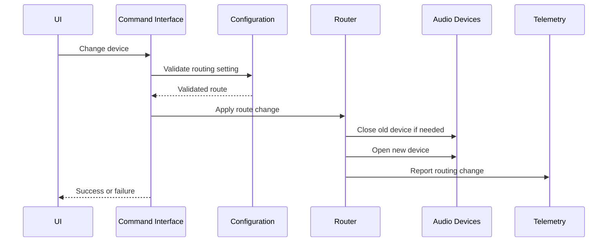

```mermaid
sequenceDiagram
    participant UI as UI
    participant Commands as Command Interface
    participant Config as Configuration
    participant Router as Router
    participant Devices as Audio Devices
    participant Telemetry as Telemetry

    UI->>Commands: Change device
    Commands->>Config: Validate routing setting
    Config-->>Commands: Validated route
    Commands->>Router: Apply route change
    Router->>Devices: Close old device if needed
    Router->>Devices: Open new device
    Router->>Telemetry: Report routing change
    Commands-->>UI: Success or failure
```
