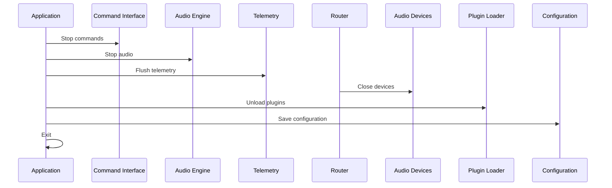

```mermaid
sequenceDiagram
    participant App as Application
    participant Commands as Command Interface
    participant Engine as Audio Engine
    participant Telemetry as Telemetry
    participant Router as Router
    participant Devices as Audio Devices
    participant Plugins as Plugin Loader
    participant Config as Configuration

    App->>Commands: Stop commands
    App->>Engine: Stop audio
    App->>Telemetry: Flush telemetry
    Router->>Devices: Close devices
    App->>Plugins: Unload plugins
    App->>Config: Save configuration
    App->>App: Exit
```
