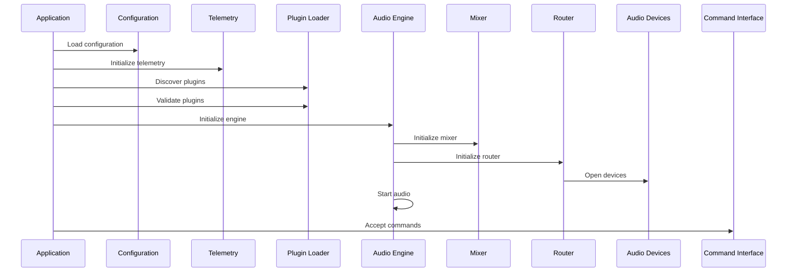

```mermaid
sequenceDiagram
    participant App as Application
    participant Config as Configuration
    participant Telemetry as Telemetry
    participant Plugins as Plugin Loader
    participant Engine as Audio Engine
    participant Mixer as Mixer
    participant Router as Router
    participant Devices as Audio Devices
    participant Commands as Command Interface

    App->>Config: Load configuration
    App->>Telemetry: Initialize telemetry
    App->>Plugins: Discover plugins
    App->>Plugins: Validate plugins
    App->>Engine: Initialize engine
    Engine->>Mixer: Initialize mixer
    Engine->>Router: Initialize router
    Router->>Devices: Open devices
    Engine->>Engine: Start audio
    App->>Commands: Accept commands
```
